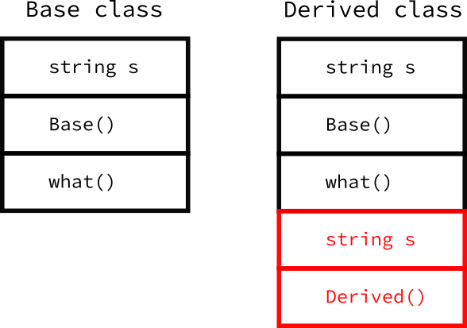
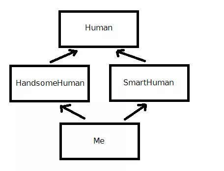

- [Inheritance](#inheritance)
  - [1. Base-Derived](#1-base-derived)
  - [2. Access Specifier를 사용한 Inheritance](#2-access-specifier를-사용한-inheritance)
  - [3. Multiple Inheritance](#3-multiple-inheritance)
  - [4. Diamond Inheritance](#4-diamond-inheritance)

<br><br>

[ inheritance - 씹어먹는 c++ ](https://modoocode.com/209)   

# Inheritance
## 1. Base-Derived
c++은 부모-자식 클래스라는 용어보다 기반-파생 클래스라 부르는 것이 적합하다고 생각   
c++은 한 명의 부모만 있는 것이 아니라 여러 개의 기반을 가질 수 있기 때문이다.   
```cpp
class Base {
  std::string s;

public:
  Base() : s("기반") { std:: cout << "기반 클래스" << std::endl; }

  void what() { std::cout << s << std::endl; }
};
```
```cpp
class Derived : public Base {
  std::string s;
public:
  // Base()로 기반 클래스의 생성자를 명시적으로 호출하지 않으면,
  // Base class의 default constructor가 호출된다.
  Derived() : Base(), s("파생") {
    std::cout << "파생 클래스" << std::endl;

    // Base의 what()을 호출
    what();
  }
};
```
`Derived class의 생성자를 호출하면, Base class의 생성자가 먼저 호출`된다.   

   
```cpp
int main() {
  Derived d;
}
```
```
기반 클래스
파생 클래스
기반
```
여기서 `Derived 생성자 내부에서 what()을 호출했는데 "기반"이 출력된 이유`에 주목한다.   
what() 함수는 Base에 정의했기 때문에 Derived의 s가 아니라 Base의 s를 출력하여 "기반"이 나온다.   
```cpp
Derived() : Base(), s("파생") {
  std::cout << "파생 클래스" << std::endl;
  what();
}

// Derived class가 Base class의 what 함수를 overriding
void what() { std::cout << s << std::endl; }
```
Derived에 what 함수가 정의됐기 때문에 Derived 생성자에서 what을 호출할 때, 내부의 what을 호출한다. 이러한 개념을 `overriding`이라 한다.   

## 2. Access Specifier를 사용한 Inheritance
```cpp
class Derived : public Base
```
사용한 Access Specifier의 종류에 따라 Inheritance의 방식이 변한다.   
`public`인 경우, Base class의 Access Specifier를 그대로 적용한다. 즉, Derived class 입장에서 Base class의 `public은 public`, `protected는 protected`, `private는 private`로 동작한다.   

`protected`인 경우, Derived class에서 `public은 protected`로 바뀌고 나머지는 그대로 유지한다.   

`private`인 경우, Derived 입장에서 `Base class의 모든 Access Specifier가 private`가 된다.   
```cpp
class Base {
public:
  std::string parent_string;
  ...
};

class Derived : private Base {
  std::string child_string;
};
```
```cpp
int main() {
  Derived d;
  std::cout << d.parent_string << std::endl;  // compile error
}
```
Base 객체에서 parent_string에 접근하면 public을 사용하기 때문에 main()에서 접근할 수 있지만, `Derived 객체에서 parent_string에 접근하려하면, private 상속으로 인해 접근할 수 없다`.   

## 3. Multiple Inheritance
하나의 class가 다른 여러 개의 class들을 상속 받는 것을 허용한다.   
그렇다면 `c instance의 생성자를 호출하면 base class의 호출 순서는 어떻게 될까?`   
```cpp
class A {
public:
  int a;
  A() { std::cout << "A 생성자 호출" << std::endl; }
};

class B {
public:
  int b;
  B() { std::cout << "B 생성자 호출" << std::endl; }
};

class C : public A, public B {
public:
  int c;
  C() : A(), B() { std::cout << "C 생성자 호출" << std::endl; }
};
```
이는 생성자의 초기화 리스트 순서가 아닌 상속 순서에 맞춰서 호출된다.   
```cpp
class C : public A, public B {} // A, B, C
class C : public B, public A {} // B, A, C
```

## 4. Diamond Inheritance
Multiple Inheritance를 허용함으로써 발생하는 문제를 나타낸다.   
   
Me class는 HandsomeHuman과 SmartHuman class를 상속 받는다. 이처럼 `상속되는 두 개의 class가 공통의 Base class를 포함하고 있는 형태`를 Diamond Inheritance라고 부른다.   

만약 Human class에 `name`이라는 멤버 변수가 있으면, HandsomeHuman과 SmartHuman에도 같은 변수가 존재한다. 그러면 Me에서 name에 접근하면 `두 클래스에 같은 변수가 존재하기 때문에 변수가 겹치는 상황이 발생하여 compile error가 발생`한다.   
```cpp
class HandsomeHuman : public virtual Human {};
class SmartHuman : public virtual Human {};
class Me : public HandsomeHuman, public SmartHuman {};
```
`Human을 virtual로 상속 받으면 Me에서 Multiple Inheritance 상황에서도 compiler가 언제나 Human을 한 번만 포함하도록 지정`한다.   