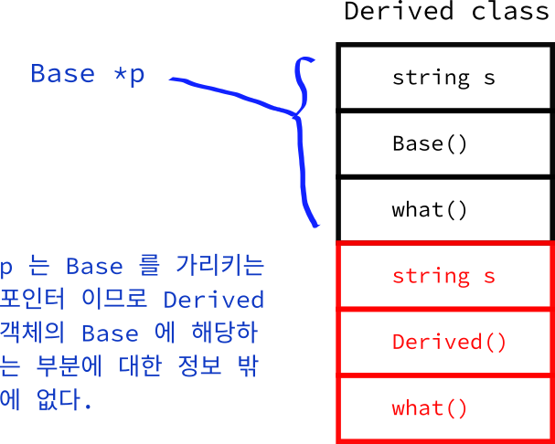
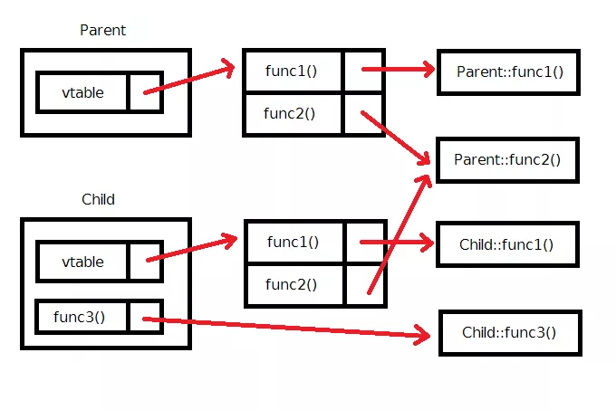

- [Polymorphism](#polymorphism)
  - [1. Upcasting](#1-upcasting)
  - [2. Downcasting](#2-downcasting)
    - [dynamic\_cast](#dynamic_cast)
  - [3. virtual](#3-virtual)
    - [Dynamic binding](#dynamic-binding)
    - [override keyword](#override-keyword)
    - [EmployeeList 문제 해결](#employeelist-문제-해결)
    - [virtual destructor](#virtual-destructor)
    - [virtual function의 구현 원리](#virtual-function의-구현-원리)
    - [pure virtual function과 abstract class](#pure-virtual-function과-abstract-class)
      - [abstract class 특징 1](#abstract-class-특징-1)
      - [abstract class 특징 2](#abstract-class-특징-2)

<br><br>

[ virtual과 polymorphism - 씹어먹는 c++ ](https://modoocode.com/210)   
해당 링크에서 inheritance의 `is-a`와 `has-a` 관계에 대해 정독하는 것을 추천한다.   
[ virtual function과 inheritance - 씹어먹는 c++ ](https://modoocode.com/211)   

# Polymorphism
Downcasting을 통해 Base*가 가리키는 객체가 Base인지, Derived인지에 따라 다르게 동작한다.   
즉, 하나의 method를 호출했음에도 여러가지 다른 작업들을 하는 것을 polymorphism이라 한다.   
## 1. Upcasting
```cpp
class Base {
  std::string s;

public:
  Base() : s("기반") { std::cout << "기반 클래스" << std::endl; }

  void what() { std::cout << s << std::endl; }
};

class Derived : public Base {
  std::string s;

public:
  Derived() : s("파생"), Base() { std::cout << "파생 클래스" << std::endl; }

  void what() { std::cout << s << std::endl; }
};
```
```cpp
int main() {
  Base p;
  Derived d;

  Base* p_d = &d;
  p_d->what();
}
```
Base 객체를 가리키는 포인터에 Derived 객체 d를 넣었다.   
`서로 다른 클래스인데 대입이 가능한 이유`는 Derived는 Base를 상속받기 때문에 `Derived is a Base`라는 관계가 성립하기 때문이다.   
즉, Derived 객체도 Base 객체이기 때문에 Base 객체를 가리키는 포인터가 d를 가리켜도 무방하다.   

   
하지만 p_d는 Base 객체를 가리키는 포인터이므로 p_d의 what을 실행하면 Base의 what 함수가 실행된다.   
`p_d는 Derived 객체의 Base에 해당하는 정보만 가지기 때문`이다.   

## 2. Downcasting
```cpp
int main() {
  Base p;
  Derived d;

  Base* p_p = &d;
  Derived* p_d = static_cast<Derived*>(p_p);
  p_d->what();
}
```
`Derived* p_d = &p_p`는 compile error를 발생시킨다. Compiler는 Downcasting을 금지하기 때문이다.

우리는 `p_p가 가리키는 것이 Base 객체가 아니라 Derived 객체`임을 알고 있다.   
Base*를 Downcasting 함에도 불구하고 p_p가 실제로 Derived 객체를 가리키기 때문에 `Derived* p_d = &p_p`이 문제 없음을 알고 있다.   
즉, `compile error를 막기 위해서 type casting을 이용하여 Derived의 정보에 접근`할 수 있다.   

만약 `p_p가 Derived 객체가 아닌 Base 객체를 가리킨다면, runtime error가 발생`한다.   

### dynamic_cast
casting에 따른 오류를 방지하기 위해서 상속 관계에 있는 두 pointer 간에 casting을 해주는 `dynamic_cast`를 지원한다.   
```cpp
Derived* p_d = dynamic_cast<Derived*>(p_p);
```
p_p가 Base 객체를 가리킨다면, compile error가 발생한다.   

## 3. virtual
Downcasting을 통해 상속 관계에 있는 객체를 관리하는 클래스를 구현할 때, 중복되는 코드를 줄일 수 있다. 하지만 Downcasting의 문제( Base는 Derived의 내용을 모름 )가 남아있다.   
아래는 그 사례를 소개한다.   
```cpp
class Employee {
protected:
  std::string name;
  int age;

  std::string position;   // 직책 이름
  int rank;               // 순위( 값이 클수록 높음 )

public:
  Employee(std::string name, int age, std::string position, int rank)
    : name(name), age(age), position(position), rank(rank) {}
  
  Employee(const Employee& employee) {
    name = employee.name;
    age = employee.age;
    position = employee.position;
    rank = employee.rank;
  }

  Employee() {}

  void print_info() {
    std::cout << name << " (" << position << " , " << age << ") ==> "
              << calculate_pay() << "만원" << std::endl;
  }
  int calculate_pay() { return 200 + rank * 50; }
};
```
```cpp
class Manager : public Employee {
  int year_of_service;

public:
  Manager(std::string name, int age, std::string position, int rank, int year_of_service)
    : year_of_service(year_of_service), Employee(name, age, position, rank) {}
  
  Manager(const Manager& manager) 
    : Employee(manager.name, manager.age, manager.position, manager.rank) {
      year_of_service = manager.year_of_service;
  }

  Manager() : Employee() {}

  int caculate_pay() { return 200 + rank * 50 + 5 * year_of_service; }
  void print_info() {
    std::cout << name << " (" << position << " , " << age << ", "
              << year_of_service << "년차) ==> " << calculate_pay() << "만원"
              << std::endl;
  }
};
```
Employee( Base ) - Manager( Derived ) 관계   
```cpp
class EmployeeList {
  int alloc_employee;         // 할당한 총 직원수
  int current_employee;       // 현재 직원수
  Employee** employee_list;   // 직원 데이터

public:
  EmployeeList(int alloc_employee) : alloc_employee(alloc_employee) {
    employee_list = new Employee*[alloc_employee];
    current_employee = 0;
  }

  void add_employee(Employee* employee) {
    // current_employee > alloc_employee인 경우는 없다고 가정
    employee_list[current_employee] = employee;
    ++current_employee;
  }
  int current_employee_num() { return current_employee; }
  void print_employee_info() {
    int total_pay = 0;
    for (int i = 0; i < current_employee; i++) {
      employee_list[i]->print_info();
      total_pay += employee_list[i]->calculate_pay();
    }
    std::cout << "총 비용 : " << total_pay << "만원 " << std::endl;
  }

  ~EmployeeList() {
    for (int i = 0; i < current_employee; ++i) {
      delete employee_list[i];
    }
    delete[] employee_list;
  }
};
```
Employee를 담고 있는 List 클래스   
polymorphism을 이용해서 EmployeeList class 내부에 Manager와 Employee 클래스의 정보를 모두 관리하는 것이 아니라, Employee 클래스의 정보만 다루는 방식이다.   
```cpp
int main() {
  EmployeeList emp_list(10);
  emp_list.add_employee(new Employee("노홍철", 34, "평사원", 1));
  emp_list.add_employee(new Employee("하하", 34, "평사원", 1));
  emp_list.add_employee(new Manager("유재석", 41, "부장", 7, 12));
  emp_list.add_employee(new Manager("정준하", 43, "과장", 4, 15));
  emp_list.add_employee(new Manager("박명수", 43, "차장", 5, 13));
  emp_list.add_employee(new Employee("정형돈", 36, "대리", 2));
  emp_list.add_employee(new Employee("길", 36, "인턴", -2));
  emp_list.print_employee_info();
}
```
하지만 employee_list[i]가 Manager 객체일 때, Manager의 info가 아닌 Employee의 info가 호출되서 의도와 다른 결과를 만든다. calculate_pay 또한 마찬가지다.   
`employee_list[i]가 Employee 객체를 가리키기 때문에 Manager 객체의 info에 접근하지 못하기 때문`이다.   

이를 해결하는 방법이 `virtual` keyword이다.   
### Dynamic binding
`compile time에 어떤 함수가 실행될지 정해지지 않고 runtime에 정해지는 것`을 dynamic binding이라 한다.   
```cpp
class Base {
...
  virtual void what() { ... }
};
```
Base class의 what 함수에 virtual keyword를 추가했다.   
```cpp
int main() {
  Base p;
  Derived d;

  Base* p_d = &d;
  Base* p_p = &p;

  std::cout << " == 실제 객체는 Base == " << std::endl;
  p_p->what();

  std::cout << " == 실제 객체는 Derived == " << std::endl;
  p_d->what();
}
```
p_p와 p_d는 모두 Base* 객체를 가리킨다. 따라서 모두 Base* 객체의 what 함수가 실행될 것 같지만, `p_d가 Derived 객체를 가리켰음을 알고 Derived의 what 함수가 호출`됐다.   

즉, virtual keyword로 인해 `runtime에 p_d가 실제로 가리키는 객체를 추적하여 적절한 what 함수를 호출`한다.   

기본적으로 `static binding( compile time에 어떤 함수를 호출할지 정함 )`로 동작하지만 `virtual function은 dynamic binding으로 동작`한다.   

### override keyword
Derived에서 Base class의 virtual function을 override하기 위해서는 두 함수의 signature가 일치해야 한다.   
```cpp
class Derived : public Base {
...
  void what() override { ... }
};
```
Derived class에서 Base class의 virtual function을 override하는 경우, override keyword를 통해서 compiler에게 명시적으로 알려준다.   
이러면 `function signature가 일치하는지 compiler가 알려주기 때문에 프로그래머의 실수를 예방`할 수 있다.   

### EmployeeList 문제 해결
```cpp
class Employee {
...

  virtual void print_info() { ... }
  virtual int calculate_pay() { ... }
};
```
```cpp
class Manager : public Employee {
...

  void print_info() override { ... }
  int calculate_pay() override { ... }
};
```
employee_list[i]가 Employee*를 가리켜도 해당 포인터가 Manager 객체라면 Manager Function을, Employee라면 Employee Function을 호출한다.   

### virtual destructor
`inheritance 시에 destructor를 virtual function으로 만들어야 한다`.   
```cpp
class Parent {
public:
  Parent() { std::cout << "Parent 생성자 호출" << std::endl; }
  ~Parent() { std::cout << "Parent 소멸자 호출" << std::endl; }
};

class Child : public Parent {
public:
  Child() : Parent() { std::cout << "Child 생성자 호출" << std::endl; }
  ~Child() { std::cout << "Child 소멸자 호출" << std::endl; }
};
```
```cpp
int main() {
  std::cout << "--- 평범한 Child 만들었을 때 ---" << std::endl;
  { 
    Child c; 
  }

  std::cout << "--- Parent 포인터로 Child 가리켰을 때 ---" << std::endl;
  {
    Parent *p = new Child();
    delete p;
  }
}
```
```
--- 평범한 Child 만들었을 때 ---
Parent 생성자 호출
Child 생성자 호출
Child 소멸자 호출
Parent 소멸자 호출
--- Parent 포인터로 Child 가리켰을 때 ---
Parent 생성자 호출
Child 생성자 호출
Parent 소멸자 호출
```
Downcasting으로 Parent*가 Child 객체를 가리키는데, 이러한 포인터가 소멸할 때는 Child 소멸자가 호출되지 않는다.   
이러면 Child 객체의 모든 메모리를 제거하지 못하기 때문에 `memory leak`가 발생한다.   
```cpp
virtual ~Parent() { std::cout << "Parent 소멸자 호출" << std::endl; }
```
따라서 `Base의 소멸자를 virtual function으로 지정함으로써 Downcasting 시에 발생하는 memory leak를 방지`한다.   
`~Child()`를 호출하면서, Child 소멸자가 알아서 Parent 소멸자도 호출하기 때문이다. 이는 Child 자신이 Parent를 상속받는다는 것을 알고 있기 때문이다.   

### virtual function의 구현 원리
모든 함수를 virtual function으로 만들면 어떨까?   
JAVA는 모든 함수들을 기본적으로 virtual 함수로 선언한다. c++은 왜 virtual keyword를 사용해야 dynamic binding이 수행될까?   

`virtual function을 사용하면 약간의 overhead가 발생하기 때문`이다.   
```cpp
class Parent {
public:
  virtual void func1();
  virtual void func2();
};

class Child : public Parent {
public:
  virtual void func1();
  void func3();
}
```
c++ compiler는 virtual function이 하나라도 존재하는 class에 `virtual function table( vtable )`을 만든다.   
   
`함수의 이름과 실제로 어떤 함수가 대응되는지 table로 저장`한다.   
일반적인 함수는 vtable을 거치지 않고 `func3()`를 호출하면 직접 실행된다.   
virtual function을 호출했을 때는 vtable을 통해 어떤 함수를 고를지 결정하고 해당 함수를 실행한다.   
```cpp
Parent* p = Parent();
p->func1();
```
위 코드의 실행 과정을 살펴본다.   
먼저 p가 Parent를 가리키는 포인터이므로, func1()의 정의를 Parent class에서 찾는다. func1()이 virtual function이므로, func1()을 직접 실행하는 것이 아니라 vtable에서 func1()에 해당하는 함수를 실행한다.   
```cpp
Parent* p = Child();
p->func1();
```
p가 실제로는 Child 객체를 가리키기 때문에 Child 객체의 vtable을 참조하여 Child::func1()을 호출한다.   

### pure virtual function과 abstract class
`virtual function을 하나라도 포함하는 class를 가리켜 abstract class`라고 부른다.   
```cpp
class Animal {
public:
  Animal() {}
  virtual ~Animal() {}
  virtual void speak() = 0;
};
```
```cpp
class Dog : public Animal {
public:
  Dog() : Animal() {}
  void speak override { std::cout << "왈왈" << std::endl; }
};

class Cat : public Animal {
public:
  Cat() : Animal() {}
  void speak override { std::cout << "야옹" << std::endl; }
};
```
Animal class의 speak()는 구현부가 정의되지 않고 `= 0`으로 처리한 virtual function이다.   
`무엇을 하는지 정의하지 않은 함수`라는 의미이며, 이는 곧 `반드시 overriding 해야 하는 함수`이다.   
이를 pure virtual function이라 부른다.   

`pure virtual function은 구현부가 없기 때문에 이 함수를 호출하는 것은 불가능`하다.   
```cpp
Animal a;
a.speak();      // 이를 막기 위함
```
때문에 `Animal 객체를 생성하는 것 또한 불가능`하다.   

#### abstract class 특징 1
abstract class는 해당 class를 inheritance하는 프로그래머에게 `"이 기능은 일반적인( generalize) 상황에서 만들기 힘들기 때문에 당신이 직접 구체화( specialize )되는 class에 맞춰서 만들어서 사용하라"`는 메세지를 전달한다.   

Animal class의 speak는 모든 동물에 맞는 소리가 없기 때문에 Derived class에서 이를 specialize해서 사용하는 것을 강제한다.   

#### abstract class 특징 2
자신의 instance는 생성할 수 없지만, abstract class를 가리키는 pointer는 문제 없이 만들 수 있다.   
